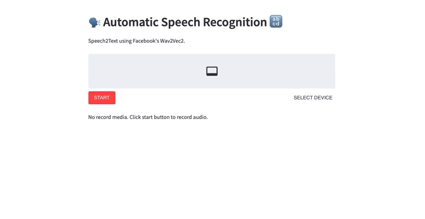

[](https://colab.research.google.com/github/1010code/streamlit-Wav2Vec/blob/main/example/Wav2Vec_Hugging_Face_Notebook.ipynb)

[Demo](https://share.streamlit.io/1010code/streamlit-wav2vec/main/app.py)

The base model pretrained and fine-tuned on 960 hours of Librispeech on 16kHz sampled speech audio. When using the model make sure that your speech input is also sampled at 16Khz. For more information check [Facebook's Wav2Vec2](https://ai.facebook.com/blog/wav2vec-20-learning-the-structure-of-speech-from-raw-audio/).



## Requirement

```txt
streamlit==1.9.0
streamlit_webrtc==0.37.0

torch==1.10.1
torchvision==0.11.2
torchaudio==0.10.1
SoundFile==0.10.3.post1
librosa==0.9.1
transformers==4.19.1
```

## Reference
- [huggingface: facebook/wav2vec2-base-960h](https://huggingface.co/facebook/wav2vec2-base-960h)